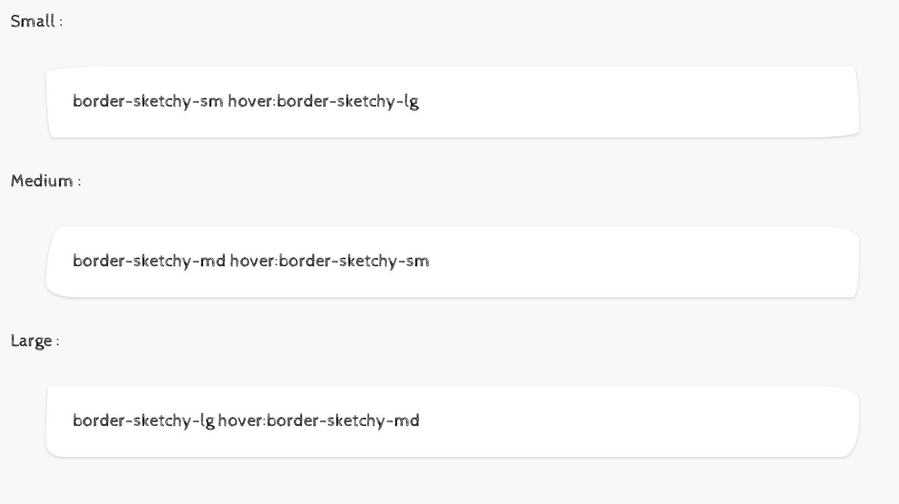

# tailwindcss border sketch
this small plugin will add Border Sketch Style to tailwindcss

Example:



Demo : [ATM Blog](http://atmonshi.sa)

Usage:

```html
<lable>Small :</lable>
<div class="border-sketchy-sm bg-white p-6 m-8 shadow hover:border-sketchy-lg hover:shadow-lg transition duration-700 ease-in-out ">
    border-sketchy-sm hover:border-sketchy-lg
</div>

<lable>Medium :</lable>
<div class="border-sketchy-md bg-white p-6 m-8 shadow hover:border-sketchy-lg hover:shadow-lg transition duration-700 ease-in-out ">
    border-sketchy-md hover:border-sketchy-sm
</div>

<lable>Large :</lable>
<div class="border-sketchy-lg bg-white p-6 m-8 shadow hover:border-sketchy-sm hover:shadow-lg transition duration-700 ease-in-out ">
    border-sketchy-lg hover:border-sketchy-md
</div>
```
